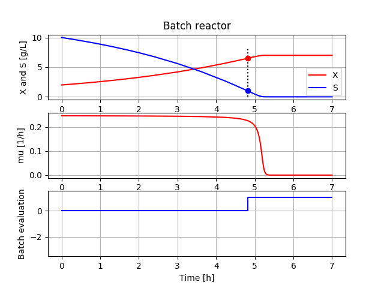

## An example of sensitivity analysis using Bioprocess Library _for_ Modelica 

Here we study a very basic example of sensitivity analysis of a bioprocess. The process is batch cultivation of a microorganism. The question is: what process parameter combinations in a given range, bring a successful outcome of the final result? 

Successful results is here defined as that final cell concentration > 5 g/L and  cultivation time < 6 hours. The end criteria is defined as when substrate concentration goes below a low level, here 1 g/L. 

Brute force simulation of 20x20 parameter value show results of what parameter combinations give a successful outcome, marked blue and failure red. This is often called design space in the pharmaceutical industry. The simulations are also done with some noise in the measurement and we see the effect of that. The lower left corner of the design space then get somewhat rounded. The simulations and diagrams you see in the Jypyter notebook mentioned below.

In practice a sensitivity analysis is often done experimentally and by reduced factor design of experiments and only a few experiments are needed. It is interesting to see how computer simulation can contribute to facilitate the experimental work. This is discussed in the following conference contribution 2019:

Axelsson J.P. and A. Elsheikh: “An example of sensitivity analysis of a bioprocess using Bioprocess Library for Modelica”, Proceedings MODPROD, Linköping, Sweden 2019, see presentation
[here](https://modprodblog.wordpress.com/modprod-2019/).

A Jupyter notebook that generate figures shown and also include a version with measurement noise you can run here
[start BPL notebook](https://colab.research.google.com/github/janpeter19/BPL_TEST2_Batch_design_space/blob/main/BPL_TEST2_Batch_design_space_colab.ipynb)
or alternatively 
[start BPL notebook with FMPy](https://colab.research.google.com/github/janpeter19/BPL_TEST2_Batch_design_space/blob/main/BPL_TEST2_Batch_design_space_fmpy_colab.ipynb).
In the menu choose Runtime/Run all. The installation takes just a few minutes. The subsequent execution of all the simulations take just about a minute or so.

You can continue in the notebook and make new simulations and follow the examples given. Here are many things to explore!

See also the related repositories: BPL_TEST2_Batch and BPL_TEST2_Batch_calibration.

Information about Bioprocess Library _for_ Modelica you find here: 
[here](https://www.researchgate.net/project/Modelica-library-for-simulation-of-bioprocesses) 
and under project log you find project updates that I hope will make you interested.

License information:
* The binary-file with extension FMU is shared under the permissive MIT-license
* The other files are shared under the GPL 3.0 license
