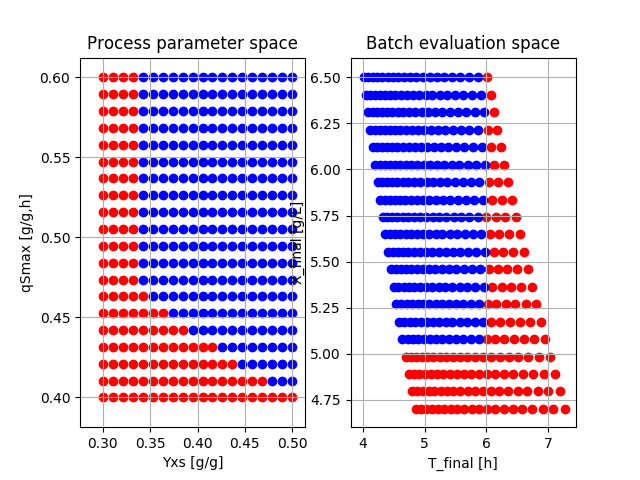

## An example of sensitivity analysis using Bioprocess Library _for_ Modelica 

Here we study a very basic example of sensitivity analysis of a bioprocess. The process is batch cultivation of a microorganism. The question is: what process parameter combinations in a given range, bring a successful outcome of the final result? 

Successful results is here defined as that final cell concentration > 5 g/L and  cultivation time < 6 hours. The end criteria is defined as when substrate concentration goes below a low level, here 1 g/L. 

Brute force simulation of 20x20 parameter value show results of what parameter combinations give a successful outcome, marked blue and failure red. This is often called design space in the pharmaceutical industry. The simulations are also done with some noise in the measurement and we see the effect of that. The lower left corner of the design space then get somewhat rounded, see figures in the folder listed below.

In practice a sensitivity analysis is often done experimentally and by reduced factor design of experiments and only a few experiments are needed. It is interesting to see how computer simulation can contribute to facilitate the experimental work. This is discussed in the following conference contribution 2019:

Axelsson J.P. and A. Elsheikh: “An example of sensitivity analysis of a bioprocess using Bioprocess Library for Modelica”, Proceedings MODPROD, Linköping, Sweden 2019, see 
https://modprodblog.wordpress.com/modprod-2019/

Files:
 - b13.mo - The Modelica model with two configuration with/without noise
 - b13_batch.py - Python script that runs the model without noise, result br13_batch.png
 - b13_batch_sweep - Script that that runs the model with 20x20 parameter settings, results br13_batch_sweep_fig1_400.png and br13_batch_sweep_fig2_400.png
 - b13_batch_noise.py - Script that run the model with noise, result br13_batch_noise_seed_1.png and _seed_2.png
 - b13_batch_noise_sweep - Script that runs the model with 20x20 parameter settings, results br13_batch_noise_sweep_fig1_400.png and _fig2_400.png

Information about Bioprocess Library _for_ Modelica you find here: 
https://www.researchgate.net/project/Modelica-library-for-simulation-of-bioprocesses and under project log you find project updates that I hope will make you interested.

